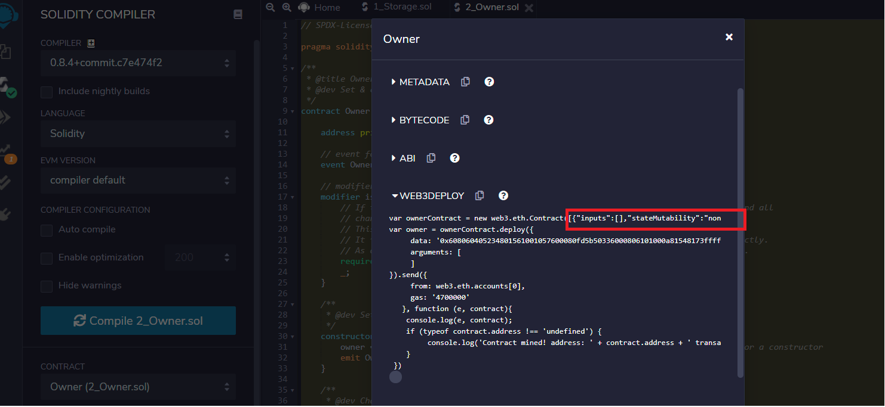

# Read Data From Smart Contract

[Watch Video Tutorial](https://www.youtube.com/watch?v=6HlHwCaAZKQ&list=PLS5SEs8ZftgXlCGXNfzKdq7nGBcIaVOdN&index=5)

Uptill now in all the previous steps we have interacted with our deployed smart contracts using the folliowing code. 
Note that we are not signing any request or transaction in the code below and therefore it can only be used to invoke functions that can be run by anyone and does not need any authentication. 

Functions that could only be invoked by certain users could not be invoked by the following code. Such functions need to be invoked by a signed transaction.

```
    const contract = new this.web3.eth.Contract(contractAbi, contractAddress);
    await contract.methods.name.call()
```


In this step we will use the 'owner.sol' example smart contract which is provided in remix IDE. If you cannot find this example in remix IDE you can copy paste the code below. 

```
// SPDX-License-Identifier: GPL-3.0

pragma solidity >=0.7.0 <0.9.0;

/**
 * @title Owner
 * @dev Set & change owner
 */
contract Owner {

    address private owner;
    
    // event for EVM logging
    event OwnerSet(address indexed oldOwner, address indexed newOwner);
    
    // modifier to check if caller is owner
    modifier isOwner() {
        // If the first argument of 'require' evaluates to 'false', execution terminates and all
        // changes to the state and to Ether balances are reverted.
        // This used to consume all gas in old EVM versions, but not anymore.
        // It is often a good idea to use 'require' to check if functions are called correctly.
        // As a second argument, you can also provide an explanation about what went wrong.
        require(msg.sender == owner, "Caller is not owner");
        _;
    }
    
    /**
     * @dev Set contract deployer as owner
     */
    constructor() {
        owner = msg.sender; // 'msg.sender' is sender of current call, contract deployer for a constructor
        emit OwnerSet(address(0), owner);
    }

    /**
     * @dev Change owner
     * @param newOwner address of new owner
     */
    function changeOwner(address newOwner) public isOwner {
        emit OwnerSet(owner, newOwner);
        owner = newOwner;
    }

    /**
     * @dev Return owner address 
     * @return address of owner
     */
    function getOwner() external view returns (address) {
        return owner;
    }
}
```


Note: There are two functions in this smart contract 

1) getOwner(): This function can be invoked by anyone and therefore it does not need a signed transaction to be invoked
2) changeOwner(): This function can only be invoked by the current owner of the smart contract (we have added a condition using modifier) and therefore the invocation of this function needs to be signed.


## step 1:

compile the 'owner.sol' smart contract on remix IDE and then deploy it on ropsten network as we did in step 26.

## step 2:

get the ABI of contract from remix IDE as shown below and also get the smart contract address from ropsten ether scan. You will need these two things to run the code in this example.

>


This step runs the 'changeOwner()' function of the smart contract through a signed invocation of the smart contract.


You can create accounts using metamask for this step and load it with test ethers from a ropston faucet like https://faucet.ropsten.be/

You will see in the code that here we have explicitly signed our transaction using the private key. This is how you should go about sending transactions in a public block chain where the nodes cannot be trusted with your private keys.

npm link typescript

npm start

or

tsc

node index


