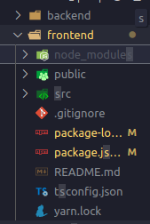
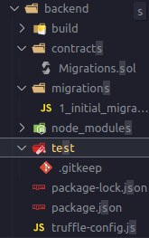
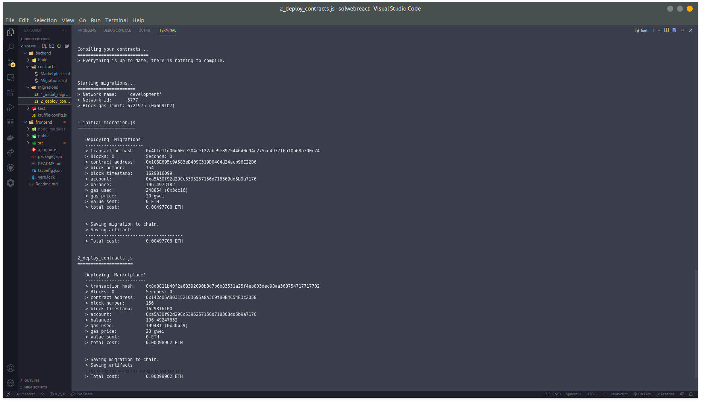
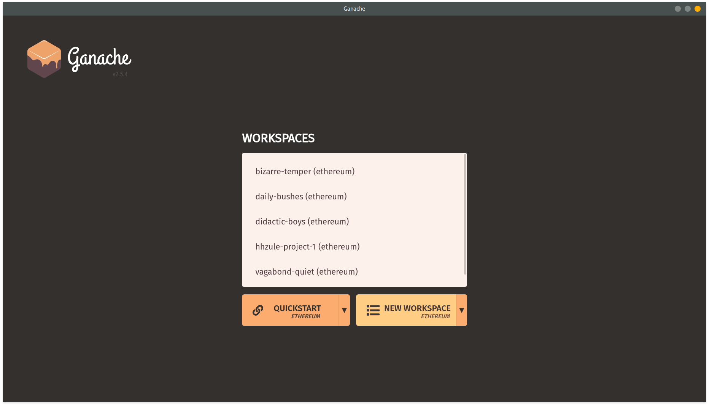
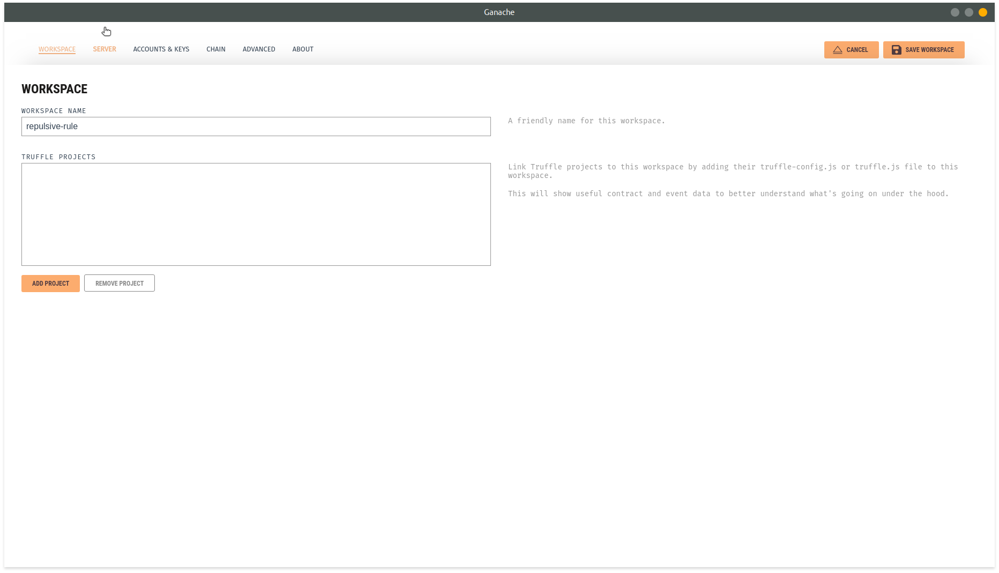
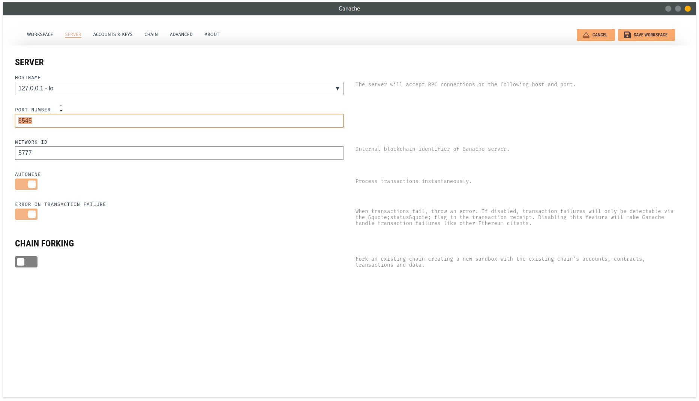
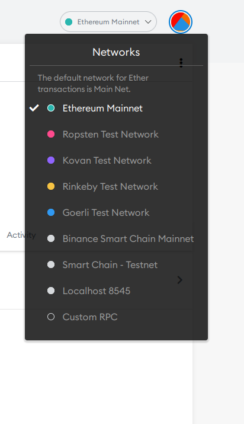
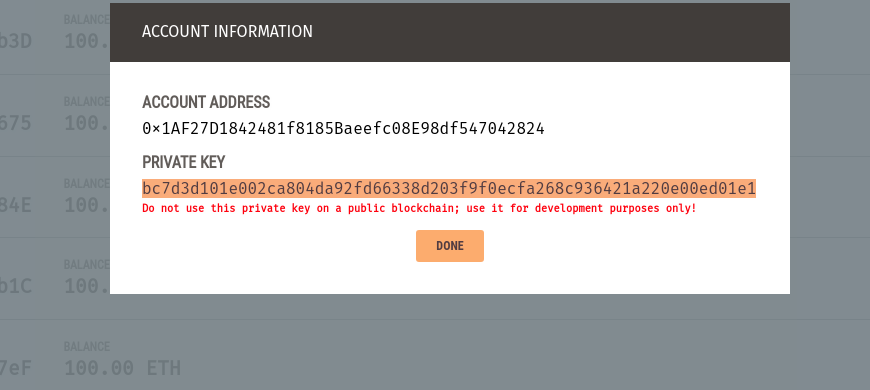
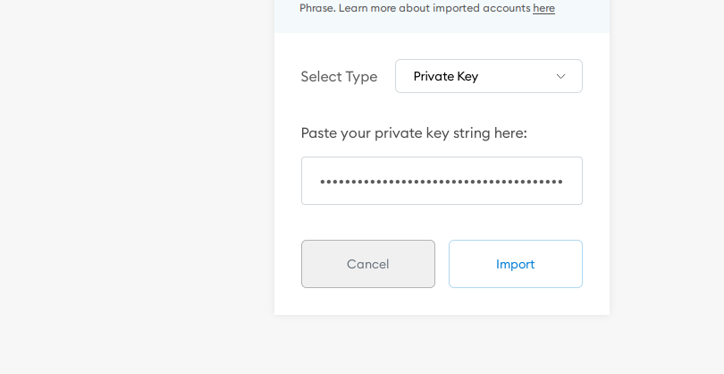

# Web3 with ReactJS

Lets create folders named *backend* and *frontend*

create a react typescript app inside *frontend* folder

  > npx create-react-app my-app --template typescript -frontend

this will create a react project with following files and folder 



Before connecting frontend with web3 we need to create a smart contract

now lets create a truffle project inside our backend folder

  > npm install -g truffle ( if not installed already)
  > truffle init

this will create a truffle project with following files and folder 



change truffle config, uncomment the following
  ```javascript
  networks: {
    development: {
     host: "127.0.0.1",     // Localhost (default: none)
     port: 8545,            // Standard Ethereum port (default: none)
     network_id: "*",       // Any network (default: none)
    },
  ```

 update solidity compiler version 
   ```javascript
  compilers: {
    solc: {
      version: "0.8.6",    // Fetch exact version from solc-bin (default: truffle's version)
      // docker: true,        // Use "0.5.1" you've installed locally with docker (default: false)
      // settings: {          // See the solidity docs for advice about optimization and evmVersion
       optimizer: {
         enabled: false,
         runs: 200
       },
      //  evmVersion: "byzantium"
      // }
    }
  }, 

  ```
 add the following to mention the build directory storing contracts ABI inside frontend's folder
   ```javascript
{
  contracts_directory: './contracts/',
  contracts_build_directory: '../frontend/src/abis/',
}
  ```

- create a file in contracts folder *Marketplace.sol* to write our smart contract
- add the following code:

```javascript
pragma solidity ^0.8.6;

contract Marketplace {
    string public name;
    uint public productCount = 0;

    struct Product {
    uint id;
    string name;
    uint price;
    address payable owner;
    bool purchased;
}
   mapping(uint => Product) public products;

    constructor(){
        name = "Marketplace";
    }
}
```
we are creating a contract with 
- a string variable *name*.
- a uint variable *productCount*
- a struct named Product
- a map named products having *id* and *Product* as key value.

Next add tow functions to our code *createProduct*: creates a new product in blockchain and *purchaseProduct*: to make a transaction, transfering the ownership of the product to the buyer and pay the amount to the product creator.

```javascript
function createProduct(string memory _name, uint _price) public {   // Require a valid name
    require(bytes(_name).length > 0);
    // Require a valid price
    require(_price > 0);
    // Increment product count
    productCount ++;
    // Create the product
    // msg.sender is the address of the user creating the product.
    products[productCount] = Product(productCount, _name, _price,payable(msg.sender), false);
}

   function purchaseProduct(uint _id) public payable {
    // Fetch the product
    Product memory _product = products[_id];
    // Fetch the owner
    address payable _seller = _product.owner;
    // Make sure the product has a valid id
    require(_product.id > 0 && _product.id <= productCount);
    // Require that there is enough Ether in the transaction
    require(msg.value >= _product.price);
    // Require that the product has not been purchased already
    require(!_product.purchased);
    // Require that the buyer is not the seller
    require(_seller != msg.sender);
    // Transfer ownership to the buyer
    _product.owner = payable(msg.sender);
    // Mark as purchased
    _product.purchased = true;
    // Update the product
    products[_id] = _product;
    // Pay the seller by sending them Ether
    _seller.transfer(msg.value);
}
```
Finally add the events to the code

```javascript
event ProductCreated(
    uint id,
    string name,
    uint price,
    address payable owner,
    bool purchased
);

event ProductPurchased(
    uint id,
    string name,
    uint price,
    address payable owner,
    bool purchased
);

```
and add the emitter to the respective functions 

```javascript
 emit ProductCreated(productCount, _name, _price, payable(msg.sender), false);
 ```
 in the createProduct function, after product is created successfully and 
 ```javascript
  emit ProductPurchased(productCount, _product.name, _product.price, payable(msg.sender), true);
 ```
  in the purchaseProduct function, after transaction is successfull

now lets complile the code
> truffle compile

Finally we need to deploy this smart contract to Ganache
> create a file *2_deploy_contracts.js* in migrations folder

This file tells Truffle to to deploy our smart contract to the blockchain, numbered to order the run.

 add the following :
```javascript
const Marketplace = artifacts.require("Marketplace");

module.exports = function(deployer) {
  deployer.deploy(Marketplace);
};

```
Now run 
 > truffle migrate --reset

 # Smart contract tests 

 Create a file * Marketplace.test.js* for the smart contract tests in the *tests* folder:

 install the dependencies for testing.
 > npm i chai chai-as-promised

add tools to our test suite 

```javascript
require('chai')
.use(require('chai-as-promised'))
.should()

```

we have created tests for the following:
- Contract is deployed successfully
- Products are created
- Products are listing as expected
- Products are sold with proper transaction

Now test them.
> truffle test

lets compile with

> truffle migrate --reset  




# Now move on to frontend

 install metamask to your browser

 Download Ganache from https://www.trufflesuite.com/ganache

Connect Metamask to our Ganache personal blockchain instance following the steps
- start Ganache

- click on new workspace  


- go to server section  


- change port number to 8545  


- now click on save workspace  


- then open metamask in your browser
- create a new account

- click on ethereum mainet  


- in the dropdown menu
- select localhost:8545  


- now you are connected

- go to ganache and choose any account you want and click on key  


- select the whole key and copy it  


- go to metamask
- click on the account icon  


- then select import account from dropdown menu  


- paste the copied key
- and click import  


- you should see the ethereum balance (note that this ethereum has no value, its just for testing)

## Client Side application 

install web3.js 

> npm i web3

install typechain for generating types of contract

> npm i typechain @typechain/web3-v1

- add the scripts for generating types 
```json 
  "scripts": {
    "start": "react-scripts start",
    "build": "react-scripts build",
    "test": "react-scripts test",
    "eject": "react-scripts eject",
    "generate-types": "typechain --target=web3-v1 \"./src/abi/*.json\"" ,
    "postinstall": "yarn generate-types"
  }
  
  ```
- generate types by running command *npm generate-types*
this will create types folder inside src directory

Start coding, add the following code in App.js

```javascript
import Web3 from 'web3'
```

- instantiate web3.

```javascript
  const loadWeb3 = async () => {
    if (window.ethereum) {
      window.web3 = new Web3(window.ethereum);
      try{
       // Request account access if needed
      await window.ethereum.enable();
    }catch (error) {
       window.alert(
        "User denied account access...!"
      );
    } 
    }else if (window.web3) {
      window.web3 = new Web3(window.web3.currentProvider);
    } else {
      window.alert(
        "Non-Ethereum browser detected. You should consider trying MetaMask!"
      );
    }
  };

```
Once web3 is initialized, lets get the data from smart contract,

```javascript
  const loadBlockchainData = async () => {
    const web3: Web3 = window.web3;
    const accounts = await web3.eth.getAccounts();
    try {
      //Read the networkID to determine the network
      const networkId : number= await web3.eth.net.getId();
      const netId = networkId as unknown as keyof typeof Marketplace.networks 
       const networkData = Marketplace.networks[netId];
      if (networkData) {
        //instantiate the smart contract 
        const marketContract  = await new web3.eth.Contract(
          Marketplace.abi as AbiItem[],
          networkData.address
        ) as unknown as MPType

    const productCount = await marketContract.methods.productCount().call() as unknown as number
    // Load products
    let productarray: Product[] = [];
    for (var i = 1; i <= productCount; i++) {
      const product : Product = await marketContract.methods.products(i).call();
      productarray.push(product);
    }} else {
      window.alert("Marketplace contract not deployed to detected network.");
    }}catch (error) {
      window.alert("network not detected.");
    }};
```
We need 2 functions to call smart contract methods
### CreateProduct

```javascript
  const createProduct = async(name: string, price: number) => {
    if(!marketplace){
      return
    }
    try {
     await marketplace.methods
        .createProduct(name, price)
        .send({ from: account })
        .on("error", function (error: Error) {
          window.alert(error.message);
        });
        await loadBlockchainData()
    } catch (error) {
      window.alert(error.message);
    } };
```

### PurchaseProduct
```javascript 
    const purchaseProduct = async(id: string, price: number) => {
    let idn = Number(id);
    if(!marketplace){
      return
    }
    try {
      marketplace.methods
        .purchaseProduct(idn)
        .send({ from: account, value: price })
        .on("error", function (error: Error) {
          window.alert(error.message);
        });
        await loadBlockchainData()
    } catch (error) {
      window.alert(error.message);
    }};
```


