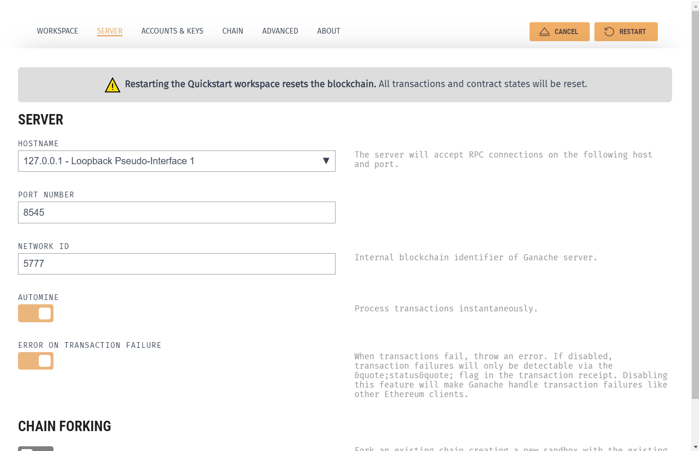
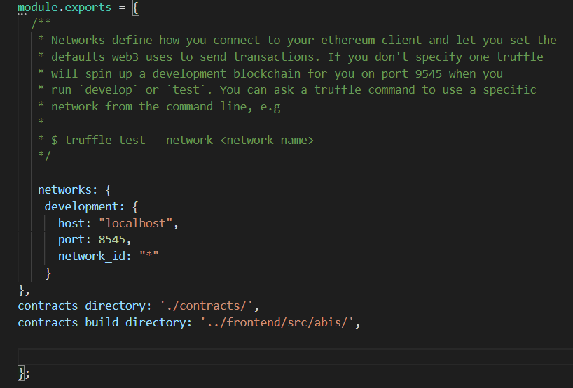

# Setup (for deploying the contract on ganache)

### 1) go to the backend folder and install dependencies (yarn install or npm install)

### 2) download Ganache from https://www.trufflesuite.com/ganache

### 3) Open Ganache and go to settings. In settings click on the server tab and change the port number to 8545 (we are doing this because metamask allows us to easily connect to this port number)

>

### 4) Open the truffle-config file and make sure that the network configuration is same as shown in the picture below. Here we are saying that we want to deploy our contracts to this network.
If you want to deploy your contracts to a public network you can change this network configuration.

You can also see that we are saving our contract artifacts in the frontend directory. We are doing this because we will be using some information from them in our frontend code.

>

### 5) Make sure you have a migration file for the Social Media contract in the migrations directory

### 6) Run 'truffle test' to see if all the tests are passing

### 7) Run 'truffle compile' to compile the contracts

### 8) Run 'truffle deploy' to the deploy the smart contracts to the blockchain

The code for the contract is in the contract's directory and the test directory contains the tests.


# Code Explanation 


You will find the smart contract code in the 'contracts' directory
You can find the test for this smart contract in the test directory

We have 4 public state variables 

1) postCount stores the total number of posts in the app (uint)
2) posts stores the information about the posts (mapping). for Ex. to get post with id 1 `posts[1]`
3) commentCount stores the total number of comments for each post (mapping). for Ex. to get number of comments on post with id 1 `commentCount[1]'
4) comments stores the information about the comments on each post (nested mapping). for Ex. to get the first comment on post with id 1 `comments[1][1]`
```


 uint public postCount = 0;
mapping(uint => socialMediaPost) public posts;
mapping(uint => uint) public commentCount;
mapping(uint => mapping(uint => socialMediaComment)) public comments;

```

There are two functions in the contract. 1) createPost 2) createComment


The code for createPost function is shown below. 

It only takes 1 input that is the text for the post. If the _text string is empty it throws an error.
It creates a post and stores it in the posts state variable and also emits an event
```

function createPost (string memory _text ) public {

    require(bytes(_text).length > 0);

    postCount++;

    posts[postCount] = socialMediaPost(postCount,_text,msg.sender);
    emit postCreated(postCount, _text, msg.sender);

    
}

```


The code for createComment function is shown below. 

It only takes 2 inputs. The text for the comment and the postId. 
This function also stores comments in the state variables and emits events
```

function createComment (string memory _text,uint _postId) public {

    require(bytes(_text).length > 0);


    require(_postId > 0 && _postId <= postCount);


    commentCount[_postId]++;

    comments[_postId][commentCount[_postId]] = socialMediaComment(commentCount[_postId],_text,msg.sender,_postId);
    emit commentCreated(commentCount[_postId], _text, msg.sender, _postId);
    
    
}


```

